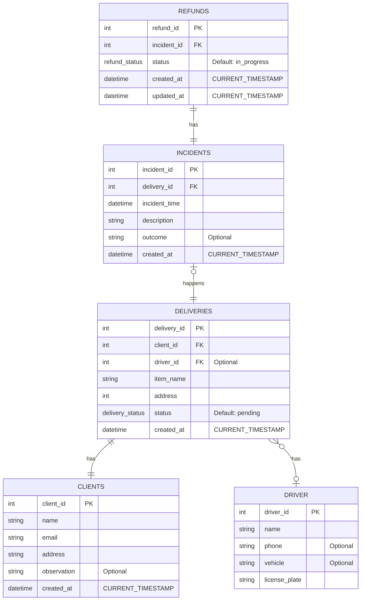

# Ease Audit Delivery
Internal persistence system for registering and audit deliveries and refunds.

## About 
Ease Audit Delivery is a command line application of delivery management service that tracks deliveries and incidents while providing refund management and auditing capabilities.

### Database relational model
The database is design to support all delivery needs and tracking. The deliveries entity relies in a strong relation between the client and a non required relation between drivers. Once a delivery is connected to a client and driver, its is considered **assigned**.

Assigned deliveries have a custom enumerator type named `delivery_status`, which can have the following values: `'created', 'undelivered', 'pending', 'delivered', 'refunded'`. Some indexes were create for query optimization: 

```sql
CREATE INDEX IF NOT EXISTS idx_driver ON deliveries(driver_id);
CREATE INDEX IF NOT EXISTS idx_created_at ON deliveries(created_at);
CREATE INDEX IF NOT EXISTS idx_client ON deliveries(client_id);
CREATE INDEX IF NOT EXISTS idx_status ON deliveries(status);
```


The `incidents` entity are binded by relation with deliveries and can be related with `refunds` through the `incident_id` foreign key in refunds table.

Refunds table has a status value, which can have the following values: `'in_process', 'not_refunded', 'refunded'`.



## requirements and installation
The system runs in **Node.js** and also need the following application to be installed: 

| Application | why it's needed | recommended version |
|-------------|-----------------|---------------------|
| Node.js | The command line server runs in it | 24
| Postgres | The database technology used for persistence | 18
| Redis | Caching system used for returning query fast | 8
| mongo | Auditory events database | 8

### Docker instalation
If your server has a docker instance installed, you can just install the Node.js and run the follow command:

```sh
docker compose up -d
```

### Environment Variables

- POSTGRES_HOST: Postgress database host 
- POSTGRES_DB: Postgress database schema 
- POSTGRES_USER: Postgress database username 
- POSTGRES_PASSWORD: Postgress database password 
- MONGO_INITDB_ROOT_HOSTNAME: Mongodb host url
- MONGO_INITDB_ROOT_PORT: Mongodb port
- MONGO_INITDB_ROOT_USERNAME: Mongodb username
- MONGO_INITDB_ROOT_PASSWORD: Mongodb password
- MONGO_INITDB_ROOT_DATABASE: Mongodb collecion name
- REDIS_URL: Redis connection Url

### Preparation
After all installation is completed, the databases are remain empty and have no models define. To prepare the database, execute the migration by running the following command:

```sh
    npm run db:migrate
```

You should also want to add some initial data. There a **optional** command for database seeding: 

```sh
    npm run db:seed
```

## Usage

The Ease Audit Delivery is a command based application, so the user interface takes place via terminal. To make it intuitive for the user, all comumication follows the same pattern: ease [entity] [opperation] [--options] [args], for example: `ease delivery list -p 1 --limit 10`. This command will return 10 (--limit 10) registers from the first page (-p 1) of deliveries.

> **Tip:** you always can type -h after command to get help of how to use it.

### General list options
| Option | type | Description | Default |
|--------|------|-------------|---------|
| -p, --offset | int | Current page returned from the paginated list. | 1 |
| -l, --limit | int | Amount of items per page. | 5 |
| --filter-by | string | Return all values with that column equals to --filter-val value. --filter-val is required for this options. | - |
| --filter-val | string | Value whose return will be filtered. Required: --filter-by | - |

### Delivery

Get a one delivery by id (for example, if id is 20):

```
ease delivery get 20 -p 1 -l 10
```

possible opperations: 
| command | Description | specific options
|---------|-------------|------------------|
| get | Get a one delivery by id. | |
| list | Query a list of deliveries | |
| list:assigned | Query all deliveries with client and driver assigned | |
| list:bind-incidents | Query all deliveries and bind its incidents | |
| create | Creates a new delivery |--client <int> REQUIRED, --driver <int>, --item <string> REQUIRED, --address <string> REQUIRED, --status ['created' | 'undelivered' | 'pending' | 'delivered']
| update | Update a delivery | --id: <int> REQUIRED, --client_id <int>,  --driver_id <int>,  --item_name <string>,  --address <string>,  --status ['created' | 'undelivered' | 'pending' | 'delivered'] 

### Incident

Get a one incident by id (for example, if id is 20):

```
ease incident get 20 -p 1 -l 10
```

possible opperations: 
| command | Description | specific options
|---------|-------------|------------------|
| list | Query a list of incident | |
| create | Creates a new incident | --delivery <int> REQUIRED, --incident_time <string> REQUIRED, --description <string> REQUIRED, --outcome <string>
| update | Update a incident |  --id: <int> REQUIRED, --delivery <int>, --incident_time <string>, --description <string>, --outcome <string>

### Refund

Get a one refund by id (for example, if refund id is 20):

```
ease refund approve 10
```

possible opperations: 
| command | Description | specific options
|---------|-------------|------------------|
| get | Get a one refund by id. | |
| list | Query a list of refund | |
| create | Creates a new refund | --incident <int> REQUIRED
| update | Update a refund |  --id: <int> REQUIRED, --incident <int>,  --status ['in_process' | 'not_refunded' | 'refunded']
| approve | Aprove a refund |  |
| reject | Update a refund |  |